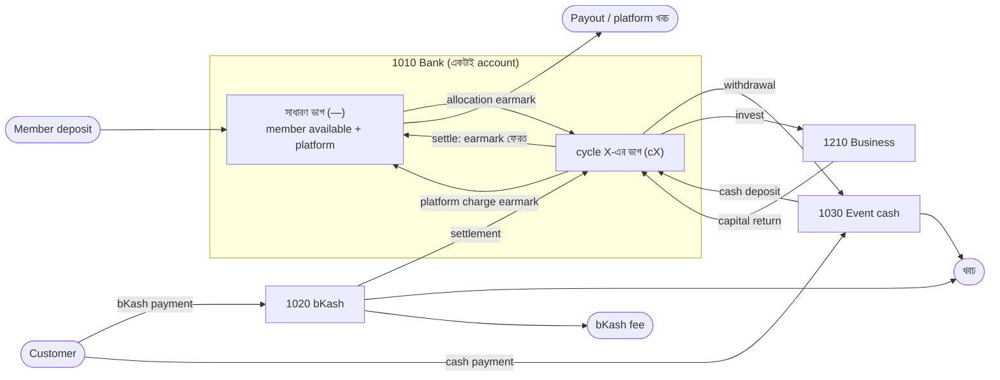

# ISF টাকার প্রবাহ: journal entry ধরে ধরে

তারিখ: ৩ অক্টোবর ২০২৬
ভিত্তি: `app/Ledger/` (commit `3ea1a87`) · নকশা: [journal-ledger-plan.md](journal-ledger-plan.md) · অডিট: [financial-flow-audit.md](financial-flow-audit.md)

এই নথিতে আছে, কোন ঘটনায় টাকা কোন account থেকে কোন account-এ যায়, ঠিক যেভাবে কোডে post হয়। শেষে একটা পূর্ণ উদাহরণে এক টাকাকে deposit থেকে payout পর্যন্ত অনুসরণ করা হয়েছে।

---

## ১. টাকা কোথায় থাকে

নগদ টাকা থাকে শুধু চারটা asset account-এ। বাকি সব account বলে **টাকাটা কার**।

| Account | কী | কোন dimension দিয়ে ভাগ |
|---|---|---|
| `1010` Bank | একটাই joint bank | `fund_cycle_id`: খালি (`—`) মানে সাধারণ ভাগ (member-এর available টাকা + platform-এর টাকা), `cX` মানে cycle X-এর ভাগ |
| `1020` bKash | merchant wallet-এ জমা customer-এর টাকা | cycle, event |
| `1030` Event cash | event-এর হাতে থাকা নগদ বা float | cycle, event |
| `1210` Business investment | business-এ খাটানো মূলধন | cycle, business |

টাকা কার, তা বলে এই account-গুলো:

| Account | মালিক |
|---|---|
| `2010` Member balance | user-এর available টাকা |
| `2020` Cycle capital | member-এর cycle-এ খাটানো মূলধন |
| `2030` Cycle result | close হওয়া project-এর লাভ বা ক্ষতি, settle-এর অপেক্ষায় |
| `4xxx` / `5xxx` | চলমান cycle বা project-এর আয়-ব্যয় (শেষে member-দের) |
| `3010` + `6xxx` − `7xxx` | platform-এর নিজের তহবিল |

**মূল সমীকরণ:** `1010 + 1020 + 1030 + 1210 = 2010 + 2020 + 2030 + (4xxx − 5xxx) + platform fund`



**দুই রকম entry আছে:**
- 💵 **আসল টাকা নড়ে**: bank statement, bKash statement বা হাতের নগদে দেখা যায়।
- 🏷️ **শুধু মালিকানা বা ভাগ বদলায়**: টাকা যেখানে ছিল সেখানেই থাকে, শুধু হিসাবে মালিক বা `fund_cycle_id` বদলায়।

নিচের সব entry-তে `Dr` = debit, `Cr` = credit। Journal-এ টাকা integer paisa-য় থাকে, এখানে পড়ার সুবিধার জন্য টাকায় লেখা।

---

## ২. সদস্য-পক্ষ

### ২.১ Deposit verify 💵
Admin deposit verify করলেন ([MemberPostings.php](../app/Ledger/Postings/MemberPostings.php) `depositVerified`)।

```
Dr  1010 Bank (—)                    amount
    Cr  2010 Member balance (user)        amount
```
টাকা bank-এ ঢুকল, user-এর পাওনা বাড়ল।

### ২.২ Registration fee বা অন্য charge পরিশোধ 🏷️
```
Dr  2010 Member balance (user, member)   amount
    Cr  6010 Registration fee            amount     (অন্য charge হলে 6020)
```
টাকা bank-এর সাধারণ ভাগেই থাকে। মালিক user থেকে platform হয়।
Charge cancel করলে এই entry-র reversal হয়, টাকা আবার user-এর।

### ২.৩ Cycle-এ allocation 🏷️
```
Dr  2010 Member balance (user, member)        amount
    Cr  2020 Cycle capital (user, member, cX)      amount
Dr  1010 Bank (cX)                            amount   earmark to cycle
    Cr  1010 Bank (—)                              amount
```
প্রথম জোড়া: user-এর available টাকা cycle-এর মূলধন হলো।
দ্বিতীয় জোড়া: একই bank, কিন্তু টাকাটা এখন cycle X-এর নামে আটকানো।

### ২.৪ Payout 💵
Admin payout `paid` করলেন।
```
Dr  2010 Member balance (user)   amount
    Cr  1010 Bank (—)                amount
```
টাকা bank থেকে বেরিয়ে user-এর হাতে গেল।

---

## ৩. Event-পক্ষ

সব line-এ dimension `cX` আর event-এর `cycle_investment_id` থাকে। নিচে সংক্ষেপে `(e)` লেখা।

### ৩.১ Bank থেকে event-এর জন্য তোলা 💵
```
Dr  1030 Event cash (e)    amount
    Cr  1010 Bank (cX)          amount
```
Cycle-এর bank ভাগে যথেষ্ট টাকা না থাকলে block।

### ৩.২ Event expense 💵
`paid_from` অনুযায়ী টাকা বেরোয়। Category `payment_fee` হলে `5310`-এ যায়, বাকি সব `5110`-এ।
```
Dr  5110 Sub-business expense (e)     amount     (payment_fee হলে 5310 Gateway fee)
    Cr  1030 Event cash (e)               amount     (paid_from = cash)
     বা 1020 bKash (e)                               (paid_from = bkash)
     বা 1010 Bank (cX)                               (paid_from = bank, cycle bank check হয়)
```

### ৩.৩ Customer-এর পরিশোধ verify 💵
bKash callback বা admin manual verify ([InvestmentPostings.php](../app/Ledger/Postings/InvestmentPostings.php) `customerPaymentVerified`)। Cash basis: টাকা পেলেই বিক্রি।
```
Dr  1020 bKash (e)                    amount     (payment_method = bkash)
 বা 1010 Bank (cX)                               (bank)
 বা 1030 Event cash (e)                          (cash বা other)
    Cr  4110 Event sales (e, order)       amount
```

### ৩.৪ Event-এর অন্যান্য আয় 💵
যেমন ব্যবহৃত box বিক্রি। `received_via` অনুযায়ী টাকা ঢোকে।
```
Dr  1030 Event cash (e) / 1010 Bank (cX) / 1020 bKash (e)    amount
    Cr  4150 Sub-business other income (e)                        amount
```

### ৩.৫ Customer-কে refund 💵
পরিশোধিত টাকার বেশি refund দেওয়া যায় না।
```
Dr  4120 Event sales refund (e, order)    amount
    Cr  1030 Event cash (e) / 1020 bKash (e) / 1010 Bank (cX)    amount
```

### ৩.৬ bKash বা নগদ bank-এ জমা 💵
```
Dr  1010 Bank (cX)              amount
    Cr  1020 bKash (e)              amount     (source = bkash: settlement)
     বা 1030 Event cash (e)                    (source = cash: নগদ আর বেঁচে যাওয়া float)
```
এখানেই event-এর টাকা cycle-এর bank ভাগে ফেরে, তাই পরের event-এ আবার তোলা যায়।

### ৩.৭ Platform charge বা asset rent 🏷️
Admin event বা business page থেকে charge বসালেন।
```
Dr  5510 Platform service charge (e)     amount     (asset_rent হলে 5520, other হলে 5590)
    Cr  6030 Platform service income (e)     amount     (6040 / 6050)
Dr  1010 Bank (—)                        amount     to platform share
    Cr  1010 Bank (cX)                       amount
```
খরচ project-এর, আয় platform-এর। টাকা একই bank-এ থাকে, cycle-এর ভাগ থেকে সাধারণ ভাগে যায়।

### ৩.৮ Event finalize (project close) 🏷️
শর্ত: pending payment নেই, `1030` = ০, `1020` = ০।
ওই event-এর সব `4xxx`/`5xxx` শূন্য করা হয়, ফলাফল যায় `2030`-এ।
```
Dr  4110 Event sales (e)              বিক্রি
Dr  4150 Other income (e)             অন্যান্য আয়
    Cr  4120 Sales refund (e)              refund
    Cr  5110 / 5310 / 55xx (e)             খরচ আর charge
    Cr  2030 Cycle result (e)              লাভ        (ক্ষতি হলে Dr 2030)
```
কোনো টাকা নড়ে না। লাভটা এখন member-দের পাওনা, settle-এর অপেক্ষায়।

---

## ৪. Business-পক্ষ

সব line-এ `(b)` = cycle আর business-এর dimension।

| ঘটনা | Entry | ধরন |
|---|---|---|
| বিনিয়োগ | `Dr 1210 Business (b)` / `Cr 1010 Bank (cX)` | 💵 |
| লাভ এলো | `Dr 1010 Bank (cX)` / `Cr 4310 Business profit (b)` | 💵 |
| মূলধন ফেরত | `Dr 1010 Bank (cX)` / `Cr 1210 Business (b)` | 💵 |
| মূলধনের ক্ষতি | `Dr 5410 Capital loss (b)` / `Cr 1210 Business (b)` | 🏷️ |
| অন্যান্য আয় | `Dr 1010 Bank (cX)` / `Cr 4150 Other income (b)` | 💵 |
| খরচ | `Dr 5110 Expense (b)` / `Cr 1010 Bank (cX)` | 💵 |

Close করার শর্ত: `1210` = ০ (সব মূলধন ফেরত এসেছে অথবা ক্ষতি হিসেবে লেখা হয়েছে)। Close entry event-এর মতোই `2030`-এ যায়।

---

## ৫. Cycle-পক্ষ

### ৫.১ Cycle-এর নিজের আয়-ব্যয় 💵
কোনো event বা business-এর নয়, যেমন চুক্তির কাগজপত্রের খরচ।
```
আয়:   Dr 1010 Bank (cX)          /  Cr 4510 Cycle income (cX)
ব্যয়:  Dr 5610 Cycle expense (cX)  /  Cr 1010 Bank (cX)
```

### ৫.২ Cycle settle 🏷️
শর্ত: সব project closed, আর `1010 (cX) = মোট capital + result`।
`result = Σ 2030 (cX) + 4510 − 5610`। ভাগ হয় member-দের `2020`-এর অনুপাতে। Platform কিছু পায় না।
```
Dr  4510 Cycle income (cX)           (থাকলে, শূন্য করতে)
    Cr  5610 Cycle expense (cX)          (থাকলে, শূন্য করতে)
Dr  2030 Cycle result (cX, প্রতি project)     লাভ  (ক্ষতি হলে Cr)
Dr  2020 Cycle capital (প্রতি member)         capital
    Cr  2010 Member balance (প্রতি member)        capital ± ভাগ
Dr  1010 Bank (—)                    cycle-এর সব টাকা    release earmark
    Cr  1010 Bank (cX)                   cycle-এর সব টাকা
```
শেষে cycle X-এর `2020`, `2030` আর `1010 (cX)`, তিনটাই ০। টাকা আবার member-এর available balance-এ।

---

## ৬. Platform-পক্ষ 💵

| ঘটনা | Entry |
|---|---|
| General income | `Dr 1010 Bank (—)` / `Cr 6090` (platform fee হলে `6020`) |
| General expense | `Dr 70xx` / `Cr 1010 Bank (—)` |

Platform fund (`3010 + 6xxx − 7xxx`) খরচের চেয়ে কম হলে expense post হয় না। তাই `1010 (—)`-এ member-এর যে টাকা আছে, তা দিয়ে platform-এর খরচ চলে না।

---

## ৭. ভুল শোধরানো

- Journal entry কখনো বদলায় না বা মোছে না।
- **Edit:** আগের entry-র reversal (সব Dr আর Cr উল্টো), তারপর নতুন entry, key-তে নতুন version (`:v2`, `:v3` …)।
- **Delete:** শুধু reversal।
- Withdrawal, expense, other income আর bank deposit এভাবে edit বা delete হয়, শুধু event finalize-এর আগে।

---

## ৮. পূর্ণ উদাহরণ: deposit থেকে payout

দুজন user: **A** (member M1) আর **B** (member M2)। একটা cycle **C1**, তার একটা event **E1**।
প্রতিটা ধাপের পরে চার জায়গার টাকা দেখানো হয়েছে।

| # | ঘটনা | Entry | Bank (—) | Bank (C1) | bKash | Cash |
|---|---|---|---:|---:|---:|---:|
| 1 | A ১২,০০০, B ১০,০০০ deposit verify | `Dr 1010(—) 22,000` / `Cr 2010 A 12,000, B 10,000` | 22,000 | 0 | 0 | 0 |
| 2 | M1, M2 registration fee ১,০০০ করে | `Dr 2010 A 1,000, B 1,000` / `Cr 6010 2,000` | 22,000 | 0 | 0 | 0 |
| 3 | M1 ১০,০০০ আর M2 ৫,০০০ C1-এ allocate | `Dr 2010` / `Cr 2020 (C1)` ১৫,০০০; `Dr 1010(C1)` / `Cr 1010(—)` ১৫,০০০ | 7,000 | 15,000 | 0 | 0 |
| 4 | E1-এর জন্য ৮,০০০ তোলা | `Dr 1030` / `Cr 1010(C1)` 8,000 | 7,000 | 7,000 | 0 | 8,000 |
| 5 | কেনাকাটা ৬,০০০ (cash থেকে) | `Dr 5110` / `Cr 1030` 6,000 | 7,000 | 7,000 | 0 | 2,000 |
| 6 | Customer bKash-এ ৯,০০০ দিলেন | `Dr 1020` / `Cr 4110` 9,000 | 7,000 | 7,000 | 9,000 | 2,000 |
| 7 | Customer নগদ ১,০০০ দিলেন | `Dr 1030` / `Cr 4110` 1,000 | 7,000 | 7,000 | 9,000 | 3,000 |
| 8 | bKash fee ১৫০ | `Dr 5310` / `Cr 1020` 150 | 7,000 | 7,000 | 8,850 | 3,000 |
| 9 | ব্যবহৃত box বিক্রি ২০০ নগদ | `Dr 1030` / `Cr 4150` 200 | 7,000 | 7,000 | 8,850 | 3,200 |
| 10 | Cancel হওয়া order-এ bKash refund ৫০০ | `Dr 4120` / `Cr 1020` 500 | 7,000 | 7,000 | 8,350 | 3,200 |
| 11 | bKash settlement bank-এ | `Dr 1010(C1)` / `Cr 1020` 8,350 | 7,000 | 15,350 | 0 | 3,200 |
| 12 | নগদ bank-এ জমা | `Dr 1010(C1)` / `Cr 1030` 3,200 | 7,000 | 18,550 | 0 | 0 |
| 13 | Platform service charge ৫০০ | `Dr 5510` / `Cr 6030`; `Dr 1010(—)` / `Cr 1010(C1)` 500 | 7,500 | 18,050 | 0 | 0 |
| 14 | E1 finalize | `4xxx/5xxx` → `Cr 2030 3,050` | 7,500 | 18,050 | 0 | 0 |
| 15 | C1-এর কাগজপত্র খরচ ৫০ | `Dr 5610` / `Cr 1010(C1)` 50 | 7,500 | 18,000 | 0 | 0 |
| 16 | C1 settle | নিচে দেখুন | 25,500 | 0 | 0 | 0 |
| 17 | SMS খরচ ৩০০ (platform) | `Dr 7020` / `Cr 1010(—)` 300 | 25,200 | 0 | 0 | 0 |
| 18 | A-কে payout ১৩,০০০ | `Dr 2010 A` / `Cr 1010(—)` 13,000 | 12,200 | 0 | 0 | 0 |

**ধাপ ১৪, E1-এর ফলাফল:**
`বিক্রি 10,000 − refund 500 + অন্যান্য আয় 200 − খরচ 6,000 − bKash fee 150 − platform charge 500 = লাভ 3,050`

**ধাপ ১৬, C1 settle:**
- Cycle result = `3,050 − 50 = 3,000`। Capital = `15,000`। `Bank (C1) 18,000 = 15,000 + 3,000` ✓, তাই settle হয়।
- ভাগ ১০,০০০ : ৫,০০০ অনুপাতে: M1 পান `10,000 + 2,000 = 12,000`, M2 পান `5,000 + 1,000 = 6,000`।

```
Dr  2030 Cycle result (C1, E1)    3,050
Dr  2020 Cycle capital M1        10,000
Dr  2020 Cycle capital M2         5,000
Dr  1010 Bank (—)                18,000
    Cr  5610 Cycle expense (C1)          50
    Cr  2010 Member balance A        12,000
    Cr  2010 Member balance B         6,000
    Cr  1010 Bank (C1)               18,000
                                 ──────   ──────
                                 36,050   36,050
```

**শেষে মিলিয়ে দেখা:**

| | টাকা |
|---|---:|
| Bank (—) | 12,200 |
| = A-এর available (`2010`) | 0 |
| + B-এর available (`2010`: 9,000 − 5,000 + 6,000) | 10,000 |
| + Platform fund (fee 2,000 + charge 500 − SMS 300) | 2,200 |

আসল bank statement-এর সাথেও মেলে: `22,000 − 8,000 + 8,350 + 3,200 − 50 − 300 − 13,000 = 12,200`।
খেয়াল করুন, ধাপ ২, ৩, ১৩, ১৪ আর ১৬-তে bank statement-এ কিছু ঘটেনি। শুধু টাকার মালিক বা ভাগ বদলেছে।

---

## ৯. এখনকার ফাঁক (বিস্তারিত অডিটে)

- `1030` Event cash আর `1020` bKash থেকে টাকা বেরোনোর আগে balance check হয় না, তাই এগুলো ঋণাত্মক হতে পারে। Finalize-এ ধরা পড়ে, তার আগে নয় (অডিট N2)।
- Event finalize হওয়ার পরে দেরিতে আসা bKash payment closed event-এর `1020`/`4110`-এ পড়ে থাকে, `2030`-এ বা settlement-এ যায় না (অডিট N1)।
