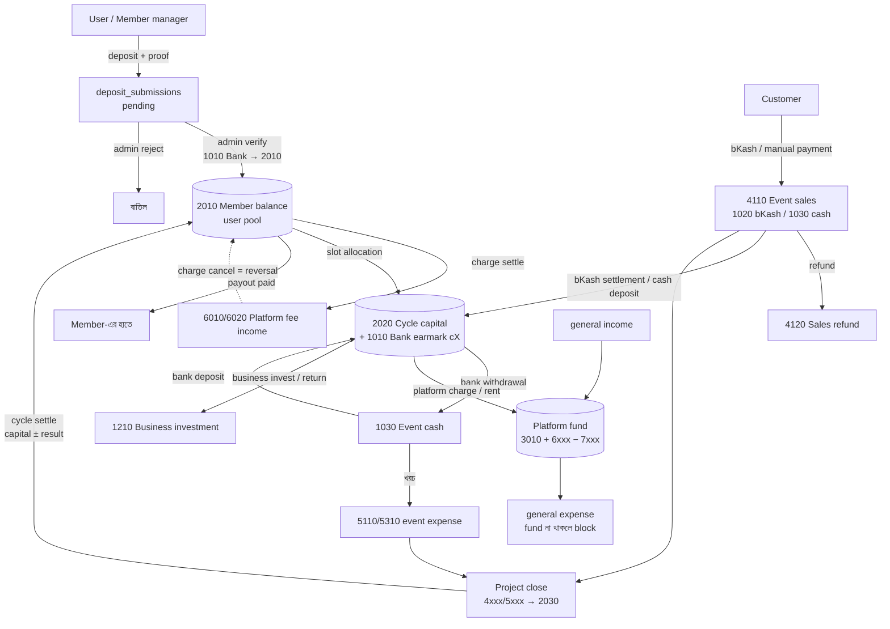

# ISF আর্থিক প্রবাহ: অডিট রিপোর্ট

প্রথম অডিট: ২ অক্টোবর ২০২৬
হালনাগাদ: ৩ অক্টোবর ২০২৬ (journal ledger চালু হওয়ার পরে, commit `3ea1a87`)
পরিধি: `isf-laravel`-এর সব টাকা-সংক্রান্ত কোড (deposit, charge, fund cycle, event, order, payment, bKash, general income/expense, treasury, payout, settlement)।
নকশা: [journal-ledger-plan.md](journal-ledger-plan.md)

চিহ্ন: ✅ ঠিক হয়েছে · 🟡 আংশিক ঠিক হয়েছে · ❌ এখনো আছে · 🆕 এই হালনাগাদে নতুন পাওয়া

---

## ১. এক নজরে

প্রথম অডিটের পরে টাকার পুরো হিসাব একটা **double-entry journal**-এ (`app/Ledger/`) চলে গেছে। প্রতিটা লেনদেন journal entry post করে, আর সব balance `Ledger::balance()` থেকে পড়া হয়। আগের পাঁচ জায়গায় ছড়ানো formula আর নেই।

**আগের সবচেয়ে বড় ফাঁক বন্ধ হয়েছে:** এখন টাকা ফেরারও পথ আছে।
- Event বা business close হলে তার লাভ বা ক্ষতি `2030 Cycle result`-এ যায়।
- Cycle settle হলে মূলধন ± লাভ capital-এর অনুপাতে member-এর `2010` balance-এ ফেরত আসে।
- Member payout request করতে পারেন, admin paid করলে bank থেকে বিয়োগ হয়।

**Bug-এর অবস্থা (আগের ১১টা):**

| অবস্থা | সংখ্যা | কোনগুলো |
|---|---|---|
| ✅ ঠিক হয়েছে | ৫ | B1, B3, B7, B10, B11 |
| 🟡 আংশিক | ৫ | B2, B4, B5, B8, B9 |
| ❌ এখনো আছে | ১ | B6 |

**নতুন পাওয়া:** ৩টা (N1–N3), বিস্তারিত §৩.২-এ। এর মধ্যে N1 (finalize-এর পরে bKash টাকা হিসাবের বাইরে থেকে যাওয়া) সবচেয়ে গুরুত্বপূর্ণ।

---

## ২. টাকা কোথায় কোথায় যাচ্ছে

### ২.১ সম্পূর্ণ চিত্র

### ২.২ প্রতিটা balance কোথা থেকে আসে

সব balance এখন journal থেকে পড়া হয়। Source table (`deposit_submissions`, `event_payments` …) শুধু কাগজ হিসেবে থাকে।

| প্রশ্ন | Journal থেকে | কোড |
|---|---|---|
| User available balance | `creditBalance(2010, user)` | [MemberPostings.php:21](../app/Ledger/Postings/MemberPostings.php#L21) |
| Member-এর cycle-এ বিনিয়োগ | `creditBalance(2020, member, cycle)` | [CyclePostings.php](../app/Ledger/Postings/CyclePostings.php) `summary()` |
| Cycle-এর হাতে তোলার মতো টাকা | `balance(1010, cycle)` | [FundCycleWithdrawalBudgetService.php:22](../app/Services/FundCycleWithdrawalBudgetService.php#L22) |
| Event বা business-এর চলমান লাভ-ক্ষতি | `creditBalance(4xxx + 5xxx, investment)` | [InvestmentPostings.php](../app/Ledger/Postings/InvestmentPostings.php) `result()` |
| Platform-এর নিজের তহবিল | `creditBalance(3010 + 6xxx + 7xxx)` | [Ledger.php](../app/Ledger/Ledger.php) `platformFund()` |
| Joint bank, member, platform-এর ভাগ | `balancesByAccount()` | [TreasuryBalanceService.php:21](../app/Services/TreasuryBalanceService.php#L21) |
| Order due | `total_amount − verified payments` (operational, journal-এ নেই) | [EventOrder.php:140](../app/Models/EventOrder.php#L140) |

Integrity check: `php artisan ledger:check` (প্রতিদিন রাত ২টায়)। দেখে entry balanced কিনা, মোট debit = credit কিনা, platform fund বা কোনো cycle-এর bank ঋণাত্মক কিনা, আর কোনো user-এর balance উল্টো দিকে গেছে কিনা।

### ২.৩ ধাপে ধাপে প্রবাহ

**ক) সদস্য-পক্ষ**
1. User deposit জমা দেন। Admin verify করলে `1010 Bank → 2010 Member balance` post হয়।
2. Admin member approve করলে registration fee-র `pending` charge তৈরি হয়।
3. User নিজের balance থেকে charge পরিশোধ করেন (`2010 → 6010`)। Lock নিয়ে balance check হয়। Registration fee হলে member `activated` হন।
4. Member (বা admin) open cycle-এর slot-এ allocation করেন: `2010 → 2020`, আর bank-এর টাকা cycle-এর নামে earmark হয়।
5. Cycle settle হলে মূলধন ± ভাগ `2010`-এ ফেরত আসে।
6. User payout request দেন। Admin `paid` করলে `2010 → 1010 Bank` post হয়।

**খ) Event-পক্ষ**
1. Admin cycle-এর bank থেকে event-এর জন্য টাকা তোলেন (`1010 cX → 1030 Event cash`)। Cycle-এর bank-এ টাকা না থাকলে block।
2. Event expense log করেন (cash, bKash বা bank থেকে)। Payment fee category `5310 Gateway fee`-তে যায়।
3. Customer order দেন, `sold_qty` বাড়ে। bKash-এ advance এলে order `confirmed` হয়।
4. প্রতিটা verified payment সঙ্গে সঙ্গে `4110 Event sales` (cash basis)।
5. Admin refund দিতে পারেন (`4120`), পরিশোধিত টাকার বেশি নয়।
6. Admin bKash settlement আর নগদ bank-এ জমা দেন (`source` = cash বা bkash আলাদা)।
7. Admin চাইলে event-এ platform charge বা asset rent বসান (`55xx → 60xx`)।
8. Finalize: checklist পার হলে (pending payment নেই, cash ০, bKash ০) 4xxx/5xxx শূন্য হয়ে ফলাফল `2030`-এ যায়, event lock হয়।

**গ) Cycle-পক্ষ**
- Cycle-এর নিজের আয়-ব্যয় (`4510`/`5610`) আলাদা entry।
- Business investment: invest, profit, capital return, capital loss, other income, expense।
- Settle: সব investment closed আর `cycle bank = capital + result` মিললে settle হয়। Platform কোনো ভাগ পায় না।

**ঘ) Platform-পক্ষ**
- General income `6xxx`-এ, general expense `7xxx`-এ। Platform fund-এ টাকা না থাকলে expense post হয় না, তাই member-এর টাকায় platform-এর খরচ চলে না।

---

## ৩. ভুল ও ঝুঁকি (bug)

### ৩.১ আগের bug-এর অবস্থা

**B1. Charge পরিশোধে cycle allocation বাদ যেত না** ✅
- এখন charge, allocation আর payout সব একই `2010` balance থেকে পড়ে, আর post করার আগে `user:{id}` lock নিয়ে check হয় ([DepositController.php:115](../app/Http/Controllers/DepositController.php#L115), [MemberPostings.php:28](../app/Ledger/Postings/MemberPostings.php#L28))।

**B2. Admin allocation validator-এ ভুল pool আর check বাদ** 🟡
- ঠিক হয়েছে: pool এখন member-এর manager-এর `2010` balance। Cycle open আর lock date check হয়। Allocation `allocateToCycle()`-এ lock-সহ হয়।
- বাকি: member `activated` কিনা দেখা হয় না ([StoreFundCycleAllocationRequest.php:38](../app/Http/Requests/Admin/StoreFundCycleAllocationRequest.php#L38))। Registration fee না দেওয়া member-কেও admin allocate করতে পারেন। member-পক্ষের validator-এ এই check আছে।

**B3. bKash-এ টাকা কাটা হতো কিন্তু হিসাবে উঠত না** ✅
- `executePayment` সফল হলে payment সবসময় `verified` হয় আর journal-এ post হয়, order আগে থেকে confirmed বা cancelled হলেও ([EventBkashPaymentService.php:207](../app/Services/EventBkashPaymentService.php#L207))। Cancelled হলে refund দিয়ে মেটানো হয়।
- একই payment-এর দুটো callback এলে `event-payment:{id}` idempotency key দ্বিতীয় entry আটকায়।

**B4. Cancel হলে stock ফেরত আসত না, pending order stock আটকে রাখত** 🟡
- ঠিক হয়েছে: cancel করলে `sold_qty` কমে ([EventOrderStatusService.php:87](../app/Services/EventOrderStatusService.php#L87))।
- বাকি:
  - পরিশোধ না করা `pending` order এখনো কখনো expire হয় না। কোনো scheduled job নেই (`routes/console.php`-এ শুধু `ledger:check`)।
  - Stock check ([PublicOrderController.php:79](../app/Http/Controllers/Api/PublicOrderController.php#L79)) lock-এর বাইরে, আর increment ([PublicOrderController.php:131](../app/Http/Controllers/Api/PublicOrderController.php#L131)) শর্ত ছাড়া। একসাথে অনেক order এলে এখনো oversell হতে পারে।

**B5. Cancel করা order-এর টাকা আয় হিসেবেই থেকে যেত** 🟡
- ঠিক হয়েছে: refund flow আছে ([EventRefundController.php](../app/Http/Controllers/Admin/EventRefundController.php)), পরিশোধিত টাকার বেশি refund দেওয়া যায় না, `4120`-এ post হয়।
- বাকি: order cancel করলে refund-এর কথা মনে করানো হয় না। admin refund না দিলে টাকা `4110`-এ থেকে যায়, আর event finalize-ও আটকায় না। bKash refund API ব্যবহার হয় না, refund manual।

**B6. Admin advance ছাড়াই order confirm করতে পারেন** ❌
- [EventOrderStatusService.php:58](../app/Services/EventOrderStatusService.php#L58): `Pending → Confirmed`-এ এখনো `isAdvancePaid()` দেখা হয় না, note-ও বাধ্যতামূলক নয়।
- Override দিয়ে `Pending → Delivered` করলে `confirmed_at` খালি থাকে। লাভের হিসাব এখন journal থেকে আসে বলে লাভে আর প্রভাব নেই। কিন্তু event summary-র `confirmedSalesQuery` ([EventOrderSummaryService.php:204](../app/Services/EventOrderSummaryService.php#L204)) থেকে order বাদ পড়ে।

**B7. Cancelled order আবার confirmed হতে পারত** ✅
- `markConfirmed()` এখন শুধু `Pending` order confirm করে, transaction-এর ভেতরে আবার check করে।

**B8. bKash-এ overpayment** 🟡
- ঠিক হয়েছে: manual payment record আর verify, দুটোতেই due-এর বেশি হলে block।
- বাকি:
  - bKash due বা advance verify করার সময় due দেখা হয় না। দুই tab থেকে দুবার advance (`initiateAdvance` আগের pending advance বাতিল করে না, [EventBkashPaymentService.php:45](../app/Services/EventBkashPaymentService.php#L45)), অথবা বাতিল (superseded) হওয়া পুরোনো due session শেষ করলে দুবার টাকা আসে।
  - টাকা এখন journal-এ ঠিকমতো ওঠে, কিন্তু `dueAmount()` `max(0, …)` ([EventOrder.php:140](../app/Models/EventOrder.php#L140)) হওয়ায় overpayment কোথাও দেখা যায় না। admin জানতে পারেন না যে refund দিতে হবে।

**B9. Finalize-এর আগে শর্ত দেখা হতো না** 🟡
- ঠিক হয়েছে: finalize এখন investment close করে, আগে checklist দেখে ([InvestmentPostings.php:289](../app/Ledger/Postings/InvestmentPostings.php#L289)): pending payment, event cash, bKash balance, business-এ আটকে থাকা মূলধন। finalize-এর পরে সব admin route `ensureNotFinalized()` দিয়ে বন্ধ, আর public bKash init-ও বন্ধ।
- বাকি: unfinalize নেই। আর finalize-এর পরে আসা bKash callback আটকানো হয় না (নিচে N1)।

**B10. ঋণাত্মক balance লুকিয়ে যেত** ✅
- Treasury আর dashboard এখন journal থেকে সরাসরি পড়ে, `max(0, …)` নেই। `ledger:check` ঋণাত্মক platform fund, cycle bank আর joint bank ধরে।
- `max(0, …)` এখন আছে শুধু `dueAmount()`, `remainingQty()` আর payout-এর `requestable_amount`-এ। এর মধ্যে `dueAmount()` B8-এর অংশ।

**B11. Race condition** ✅ (টাকার দিকে)
- Charge, allocation, payout, event withdrawal, platform expense, refund, settlement, সবগুলো `ledger_locks` table-এ lock নিয়ে check করে তারপর post করে।
- Stock-এর race এখনো আছে (B4)।

### ৩.২ 🆕 নতুন পাওয়া

**N1. Finalize বা settle-এর পরে bKash টাকা এলে সেটা হিসাবের বাইরে থেকে যায়** 🟠
- [InvestmentPostings.php:168](../app/Ledger/Postings/InvestmentPostings.php#L168) `customerPaymentVerified()` investment closed কিনা দেখে না, আর [EventBkashPaymentService.php:94](../app/Services/EventBkashPaymentService.php#L94) `handleCallback()`-এ `is_finalized` check নেই।
- Finalize-এর checklist শুধু `pending` payment দেখে। কিন্তু `failed` হয়ে যাওয়া session-ও পরে সফল হতে পারে:
  - নতুন due শুরু করলে পুরোনো due session `failed` হয় ([EventBkashPaymentService.php:79](../app/Services/EventBkashPaymentService.php#L79)), কিন্তু customer পুরোনো tab-এ পরিশোধ শেষ করলে callback সেটা execute করে verify করে।
  - Admin pending payment reject করে finalize করলেন, তারপর customer bKash-এ পরিশোধ শেষ করলেন।
- ফল: closed investment-এ নতুন `4110` আর `1020 bKash` balance তৈরি হয়। এটা `2030`-এ যায় না, settlement-এর ভাগে আসে না, আর `ledger:check` এটা ধরে না। Cycle settle হয়ে গেলে টাকাটা স্থায়ীভাবে কোনো member বা platform-এর হিসাবে পড়ে না।
- সমাধান: callback-এ investment closed হলে post বন্ধ না করে একটা আলাদা "late receipt" হিসাবে রাখুন (যেমন refund payable বা সরাসরি refund), admin-কে সতর্ক করুন। `ledger:check`-এ closed investment-এ 4xxx/5xxx বা 1020/1030 balance থাকলে problem হিসেবে ধরুন।

**N2. Event cash আর bKash balance ঋণাত্মক হতে পারে** 🟠
- Check হয় শুধু cycle-এর bank-এ (`lockAndAssertCycleCash`)। `1030 Event cash` বা `1020 bKash` থেকে টাকা বেরোলে balance দেখা হয় না:
  - cash থেকে expense ([InvestmentPostings.php:106](../app/Ledger/Postings/InvestmentPostings.php#L106)) তোলা টাকার চেয়ে বেশি;
  - cash বা bKash থেকে bank deposit ([InvestmentPostings.php:147](../app/Ledger/Postings/InvestmentPostings.php#L147)) আসলে যা আছে তার চেয়ে বেশি;
  - cash বা bKash দিয়ে refund ([InvestmentPostings.php:189](../app/Ledger/Postings/InvestmentPostings.php#L189));
  - expense log করার পরে withdrawal মুছে ফেলা বা কমানো।
- Finalize-এ `cash ≠ 0` হলে block হয়, তাই ভুলটা শেষে ধরা পড়ে। কিন্তু তার আগে event page-এ float আর bank-এর হিসাব ভুল দেখায়, আর অতিরিক্ত bank deposit cycle-এর bank-এ এমন টাকা দেখায় যা আসলে আসেনি। সেই টাকা দিয়ে অন্য event-এর withdrawal-ও pass হয়ে যায়।
- সমাধান: cash আর bKash থেকে টাকা বেরোনোর সব posting-এ `investment:{id}` lock নিয়ে `assertAvailable` দিন।

**N3. Fund cycle-এর status হাতে বদলানো যায়, ledger-এর সাথে মেলে না** 🟡
- [UpdateFundCycleRequest.php:21](../app/Http/Requests/Admin/UpdateFundCycleRequest.php#L21): edit form থেকে status `settled` বা `matured` বেছে নেওয়া যায়। আসল settlement (`settled_at` + journal entry) হয় শুধু settle button দিয়ে।
- ফলে cycle `settled` দেখায় অথচ টাকা member-এর কাছে ফেরেনি। আবার আসল settle-এর পরে admin status বদলে `open` করলে allocation আবার খুলে যায়।
- সমাধান: `settled` status শুধু `settle()` থেকে set হোক। `settled_at` থাকলে status বদলানো বন্ধ করুন।

### ৩.৩ হালকা বা বিভ্রান্তিকর (আগের তালিকা)

| বিষয় | অবস্থা |
|---|---|
| Event লাভ = `bank deposit − withdrawal`, "other income" plug | ✅ লাভ এখন journal-এর 4xxx/5xxx থেকে, plug নেই |
| Event bank deposit-এ customer-এর টাকা আর float মেশানো | ✅ deposit-এ `source` (cash বা bkash) আলাদা |
| Admin Deposits page-এ "Charge settlements +" | ✅ সরানো হয়েছে |
| Treasury-র `total_deposit_amount`-এ pending আর rejected মেশানো | ✅ verified, pending, rejected আলাদা দেখায় |

---

## ৪. যে flow নেই (missing)

### গুরুত্বপূর্ণ

| # | Flow | অবস্থা |
|---|---|---|
| 1 | Fund cycle settlement | ✅ [CyclePostings.php](../app/Ledger/Postings/CyclePostings.php) `settle()`, preview আর blocker-সহ |
| 2 | ক্ষতি কীভাবে ভাগ হবে | ✅ capital-এর অনুপাতে, লাভের মতোই। বেঁচে যাওয়া paisa সবচেয়ে বড় capital-এর member পান |
| 3 | Member withdrawal বা payout | ✅ request → admin paid বা rejected → SMS। pending request-ও balance থেকে আটকে রাখা হয় |
| 4 | Member exit settlement | 🟡 unsettled cycle-এ capital থাকলে exit block ([MemberListController.php:56](../app/Http/Controllers/Admin/MemberListController.php#L56))। exit-এর পরে বাকি `2010` balance নিজে থেকে payout হয় না, user-কে request দিতে হয় |
| 5 | Customer refund | 🟡 manual refund entry আছে। bKash refund API নেই, cancel-এর সময় refund-এর কথা মনে করানো হয় না |
| 6 | Pending order expiry | ❌ |
| 7 | Event-এর মূলধন cycle-এ ফেরত | ✅ bank deposit cycle-এর earmark করা bank-এ ফেরে, আবার তোলা যায় |

### দরকারি

| # | Flow | অবস্থা |
|---|---|---|
| 8 | Registration fee ছাড়া অন্য charge member-এর ওপর বসানো | ❌ (event বা business-এর platform charge আলাদা জিনিস, সেটা আছে) |
| 9 | Charge waive | ❌ `STATUS_WAIVED` এখনো কোথাও set হয় না |
| 10 | Offline advance (pending order-এ নগদ বা Nagad) | ❌ manual payment এখনো শুধু confirmed order-এ |
| 11 | Due মওকুফ বা write-off | ❌ |
| 12 | bKash fee নিজে থেকে হিসাবে ধরা | ❌ এখনো manual `payment_fee` expense। তবে settlement-এর আগে bKash balance ০ না হলে finalize আটকায়, তাই fee বাদ পড়লে ধরা পড়ে |
| 13 | bKash pending reconciliation job | ❌ |
| 14 | সংগঠনের নিজস্ব তহবিল আলাদা | ✅ `3010 + 6xxx − 7xxx`, তহবিল না থাকলে platform expense block |
| 15 | Withdrawal-এর আগে আসল bank check, settled cycle-এ বন্ধ | ✅ cycle-এর earmark করা bank দেখা হয়। settle-এর পরে cycle bank ০, তাই আর তোলা যায় না |
| 16 | Audit log | 🟡 টাকার প্রতিটা বদল journal-এ reversal + নতুন entry হিসেবে থাকে, কে করলেন সেটাও। কিন্তু source row-এর অন্য field (description, date, receipt) বদলালে আগের মান থাকে না |
| 17 | Report বা export | 🟡 member statement (`my-statement`), admin accounts আর journal page, cycle ledger section আছে। export আর বছরের হিসাব নেই |

---

## ৫. যা বাড়তি, অব্যবহৃত বা দুবার করা (extra)

| বিষয় | অবস্থা | পরামর্শ |
|---|---|---|
| Available balance-এর formula ৫ জায়গায় | ✅ সব `MemberPostings::availableBalance()` থেকে | — |
| `FundCycle` status `locked`, `matured` | ❌ এখনো শুধু label। `settled` এখন আসল, কিন্তু হাতেও বসানো যায় (N3) | `locked`/`matured` বাদ দিন অথবা কাজে লাগান; `settled` শুধু `settle()` থেকে |
| `Charge::STATUS_WAIVED` | ❌ কোথাও set হয় না | waive flow বানান, অথবা বাদ দিন |
| `Charge` cancel = আসলে "reverse" | ❌ cancelled charge আবার পরিশোধ করা যায় ([StoreDepositAllocationRequest.php:81](../app/Http/Requests/Deposits/StoreDepositAllocationRequest.php#L81)) | নাম বদলে `reversed` করুন, অথবা cancel আর reverse আলাদা করুন |
| `EventBkashPaymentService::initiate()` | ❌ `@deprecated`, কোথাও call হয় না ([EventBkashPaymentService.php:89](../app/Services/EventBkashPaymentService.php#L89)) | মুছে ফেলুন |
| `EventBkashPaymentService::confirmOrderWithoutPayment()` | ❌ কোথাও call হয় না ([EventBkashPaymentService.php:167](../app/Services/EventBkashPaymentService.php#L167)) | মুছে ফেলুন |
| `EventPaymentType::Manual` | ❌ advance না due তা বোঝায় না | manual payment-এও advance বা due type রাখুন, method আলাদা field-এ |
| `GeneralIncomeCategory::SaleProceeds`, `PlatformFee` | 🟡 এখন যথাক্রমে `6090` আর `6020`-এ যায়, তাই platform-এর আয় হিসেবে ঠিক জায়গায় পড়ে। কিন্তু event বিক্রির টাকা ভুল করে এখানে দিলে টাকা cycle-এর বদলে platform-এর হয়ে যাবে | `SaleProceeds` বাদ দিন অথবা label-এ স্পষ্ট লিখুন "event-এর বাইরের বিক্রি" |
| Treasury-র `total_charge_settlements` | ✅ সরানো হয়েছে, এখন `fee_income` আলাদা অংশে | — |
| `event_packages.sold_qty` (denormalized) | 🟡 cancel হলে কমে, কিন্তু race আর expiry বাকি (B4) | conditional increment (`where stock_qty - sold_qty >= qty`) ব্যবহার করুন |

---

## ৬. কোনটা আগে করবেন

1. **এখনই** (টাকা হিসাবের বাইরে যাওয়া ঠেকাতে):
   - **N1**: closed event-এ late bKash payment ধরা, আর `ledger:check`-এ closed investment-এর বাকি balance ধরা।
   - **N2**: event cash আর bKash থেকে বেরোনোর আগে balance check।
   - **N3**: `settled` status হাতে বসানো বন্ধ।
2. **পরের sprint:**
   - B8: bKash overpayment ধরা আর admin-কে দেখানো (একই order-এ দ্বিতীয় advance শুরু হলে আগেরটা বাতিল)।
   - B4: pending order expiry job আর stock-এর conditional increment।
   - B6: advance ছাড়া confirm করলে note বাধ্যতামূলক।
   - B2: admin allocation-এ `activated_at` check।
   - B5: cancel করলে পরিশোধিত টাকা থাকলে refund-এর সতর্কবার্তা।
3. **Feature:** charge বসানো আর waive, offline advance, due write-off, bKash reconciliation job, export।
4. **পরিচ্ছন্নতা:** §৫-এর অব্যবহৃত method আর status মুছে ফেলা।

---

## ৭. যাচাই নিয়ে টীকা

- এই হালনাগাদ code পড়ে করা। Ledger-এর test (`tests/Feature/Ledger/`) আছে, কিন্তু অডিটের সময় local MySQL test DB-তে সংযোগ হয়নি (`Access denied for user 'root'@'localhost'`), তাই test চালিয়ে দেখা হয়নি।
- N1 আর N2-এর জন্য এখনো কোনো test নেই।
