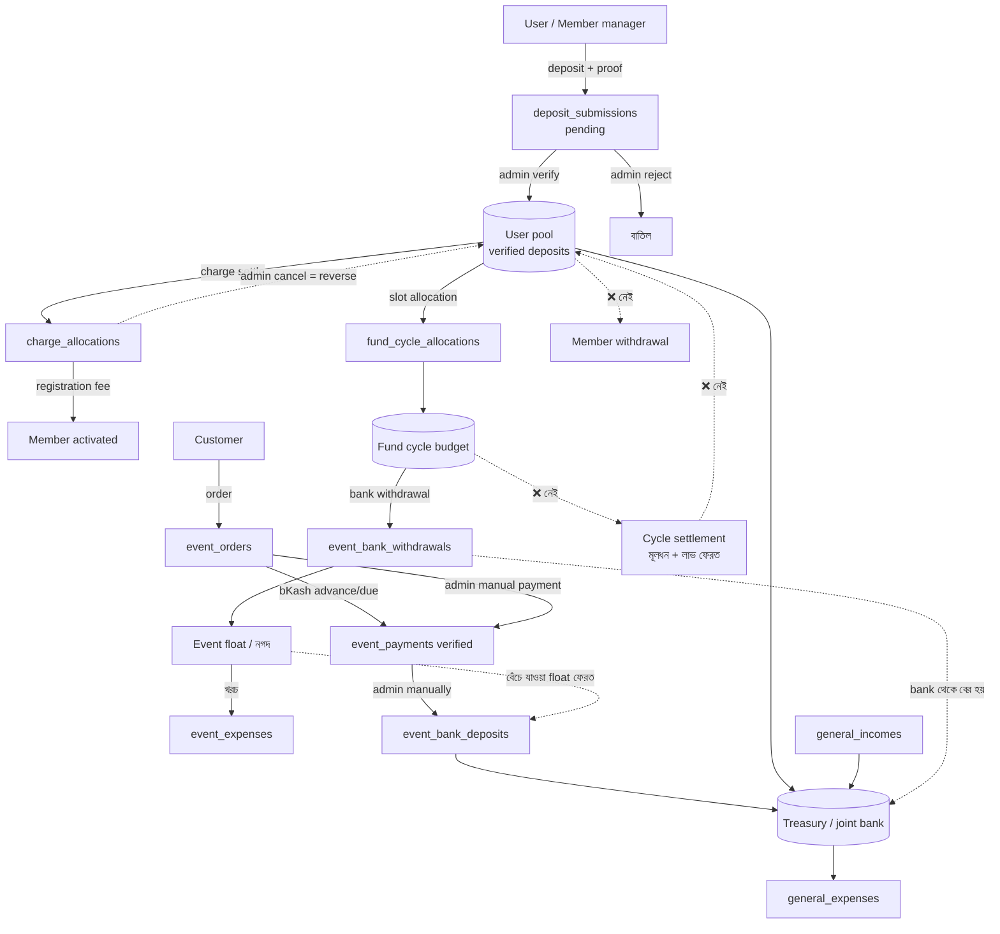

# ISF আর্থিক প্রবাহ: অডিট রিপোর্ট

তারিখ: ২ অক্টোবর ২০২৬
পরিধি: `isf-laravel`-এর সব টাকা-সংক্রান্ত কোড (deposit, charge, fund cycle, event, order, payment, bKash, general income/expense, treasury)।

---

## ১. এক নজরে

সিস্টেমে টাকা পাঁচটা স্তরে চলে:

1. **সদস্যের wallet (user pool)**: user যা deposit করেন, admin verify করলে সেটা তাঁর pool-এ জমা হয়।
2. **Charge**: pool থেকে registration fee-র মতো charge পরিশোধ হয়।
3. **Fund cycle allocation**: pool থেকে টাকা নির্দিষ্ট cycle-এর slot-এ বিনিয়োগ হয়।
4. **Event**: cycle-এর বরাদ্দ থেকে bank withdrawal হয় → সেই টাকায় খরচ হয় → customer order-এর টাকা ওঠে → bank-এ ফেরত deposit হয়।
5. **Treasury (joint bank)**: সব মিলিয়ে bank-এ কত টাকা আছে তার হিসাব।

**সবচেয়ে বড় ফাঁক:** টাকা member → cycle → event পর্যন্ত যায়, কিন্তু **ফেরার পথ নেই**। cycle শেষ হলে মূলধন আর লাভ member-এর pool-এ ফেরত আসে না। কোনো settlement বা payout flow নেই, member withdraw করতে পারেন না। `settled` বা `matured` status শুধু label হিসেবে আছে।

**নিশ্চিত bug:** ৩টা গুরুতর (টাকা দুবার খরচ বা হিসাবের বাইরে চলে যাওয়া), আর কয়েকটা মাঝারি। বিস্তারিত §৩-এ।

---

## ২. টাকা কোথায় কোথায় যাচ্ছে

### ২.১ সম্পূর্ণ চিত্র

### ২.২ প্রতিটা স্তরের হিসাব কোথায় হয়

| স্তর | কী গোনা হয় | Formula | কোড |
|---|---|---|---|
| User pool (available balance) | user-এর খরচযোগ্য টাকা | `verified deposits − charge allocations (reversed বাদে) − cycle allocations` | [DashboardController.php:65](../app/Http/Controllers/DashboardController.php#L65), [MemberFundCycleController.php:113](../app/Http/Controllers/MemberFundCycleController.php#L113), [StoreMemberFundCycleAllocationRequest.php:105](../app/Http/Requests/Members/StoreMemberFundCycleAllocationRequest.php#L105), [DepositController.php:173](../app/Http/Controllers/DepositController.php#L173) |
| Admin pool | সবার মিলিত pool | একই formula, সব user মিলিয়ে | [DashboardController.php:127](../app/Http/Controllers/DashboardController.php#L127) |
| Treasury (bank) | joint bank-এ নগদ | `verified deposits − general expense − event withdrawals + event bank deposits + general incomes` | [TreasuryBalanceService.php:52](../app/Services/TreasuryBalanceService.php#L52) |
| Cycle withdrawal budget | event-এর জন্য cycle থেকে কত তোলা যাবে | `cycle allocations − cycle-এর সব event withdrawal` | [FundCycleWithdrawalBudgetService.php:26](../app/Services/FundCycleWithdrawalBudgetService.php#L26) |
| Event float | তোলা টাকার কত খরচ হয়নি | `withdrawn − logged expenses` | [FundCycleEventController.php:248](../app/Http/Controllers/Admin/FundCycleEventController.php#L248) |
| Event bank reconciliation | customer-এর টাকা bank-এ গেছে কিনা | `verified customer payments − bank deposits` | [FundCycleEventController.php:296](../app/Http/Controllers/Admin/FundCycleEventController.php#L296) |
| Event লাভ (member view) | finalized event-এর net profit | কার্যত `bank deposits − bank withdrawals` ("other income" দিয়ে মিলানো হয়) | [MyFundCycleController.php:135](../app/Http/Controllers/MyFundCycleController.php#L135) |
| Order due | customer-এর বাকি | `total_amount − verified payments` (০-এর নিচে নামে না) | [EventOrder.php](../app/Models/EventOrder.php) `dueAmount()` |

### ২.৩ ধাপে ধাপে প্রবাহ

**ক) সদস্য-পক্ষ**
1. User deposit জমা দেন (amount, method, proof)। Status হয় `pending`।
2. Admin verify বা reject করেন। শুধু `pending` deposit review করা যায়, আর verify হলে SMS যায়।
3. Admin member approve করলে registration fee-র একটা `pending` charge তৈরি হয় ([MemberListController.php:79](../app/Http/Controllers/Admin/MemberListController.php#L79))।
4. User নিজের pool থেকে charge পরিশোধ করেন। এতে `charge_allocations` তৈরি হয়, charge `posted` হয়, আর registration fee হলে member `activated` হন।
5. Activated member open cycle-এর slot-এ allocation করেন। পরিমাণ `units × unit_amount`, যা pool থেকে কাটা যায়।
6. Admin-ও যেকোনো approved member-এর হয়ে allocation করতে পারেন।

**খ) Event-পক্ষ**
1. Admin event-এর জন্য bank withdrawal entry দেন। এটা cycle budget-এর মধ্যে থাকতে হয়।
2. Withdrawn টাকা থেকে event expense log করেন (procurement, packaging, transport, payment fee ইত্যাদি)।
3. Customer order দেন (status `pending`)। তখনই `sold_qty` বেড়ে যায়।
4. bKash-এ advance বা full পরিশোধ হলে order `confirmed` হয় আর SMS যায়। advance ০ হলে order সঙ্গে সঙ্গে confirmed হয়।
5. বাকি টাকা আসে bKash due দিয়ে, অথবা admin manual payment entry করে verify করেন।
6. Admin customer-এর টাকা আর বেঁচে যাওয়া float, দুটোই bank-এ deposit entry হিসেবে দেন।
7. Admin event `finalize` করেন। এরপর event lock হয়ে যায় এবং member view-তে লাভ দেখা যায়।

**গ) সংগঠন-পক্ষ**
- General income (sponsorship, rental, sale proceeds…) আর general expense (office, bank charge…) সরাসরি treasury-তে যোগ বা বিয়োগ হয়।

---

## ৩. ভুল ও ঝুঁকি (bug)

গুরুত্ব অনুযায়ী সাজানো।

### 🔴 গুরুতর

**B1. Charge পরিশোধে fund cycle allocation বাদ যায় না, তাই একই টাকা দুবার খরচ হয়**
- [StoreDepositAllocationRequest.php:74](../app/Http/Requests/Deposits/StoreDepositAllocationRequest.php#L74) আর [DepositController.php:123](../app/Http/Controllers/DepositController.php#L123): allocatable = `verified − charge allocations`। এখানে cycle allocation বিয়োগ হয় না।
- উদাহরণ: verified ১০,০০০ টাকা, তার পুরোটা cycle-এ allocated, আর ৫০০ টাকার একটা pending charge আছে। UI-তে বোতাম লুকানো থাকে (summary-র formula ঠিক), কিন্তু সরাসরি POST করলে charge posted হয়ে যায়। আসল balance তখন −৫০০, অথচ `max(0, …)`-এর কারণে ০ দেখায়।
- সমাধান: চার-পাঁচ জায়গায় ছড়ানো formula একটা `MemberPoolService`-এ আনুন, আর lock-সহ transaction-এর ভেতরে check করুন।

**B2. Admin allocation validator-এ চলতি cycle-এর allocation বাদ পড়ে, আর pool সবার মিলিয়ে ধরা হয়**
- [StoreFundCycleAllocationRequest.php:68](../app/Http/Requests/Admin/StoreFundCycleAllocationRequest.php#L68): `where('fund_cycle_id', '!=', $fundCycle->id)`। মানে একই cycle-এ আগে যা allocated হয়েছে তা বিয়োগ হয় না, ফলে একই cycle-এ বারবার over-allocation সম্ভব।
- Pool গোনা হয় সব user মিলিয়ে, নির্দিষ্ট member-এর manager-এর pool নয়। তাই যে user-এর এক টাকাও deposit নেই, অন্যের টাকা দিয়ে তাঁর member-এর allocation হয়ে যেতে পারে।
- এখানে member activated কিনা, cycle open কিনা, lock date পার হয়েছে কিনা, এর কোনোটাই check হয় না (member-পক্ষের validator-এ এগুলো আছে)।

**B3. bKash-এ টাকা কাটা হয়, কিন্তু হিসাবে ওঠে না**
- [EventBkashPaymentService.php:207](../app/Services/EventBkashPaymentService.php#L207) `completeAdvanceCallback`: `executePayment` সফল হয়ে টাকা কাটার পরে check হয় order আগে থেকেই `confirmed` কিনা। আগে থেকে confirmed হলে payment `pending`-ই থেকে যায়।
- এমন হয় তিন ভাবে: (ক) customer দুই tab থেকে দুবার advance শুরু করেন, কারণ `initiateAdvance` আগের pending advance বাতিল করে না; (খ) customer bKash page-এ থাকার সময় admin order manually confirm করেন; (গ) একই order-এর দুটো callback।
- ফল: customer-এর টাকা গেছে, কিন্তু verified payment-এ নেই। উল্টে ওই pending payment `hasBlockingPendingPayment()`-কে true করে দেয়, তাই customer আর bKash-এ due দিতেও পারেন না।
- সমাধান: execute-এর **আগে** order-এর অবস্থা check করুন। execute হয়ে গেলে payment সবসময় `verified` করুন, তারপর বাড়তি টাকাকে overpayment বা refund হিসেবে আলাদা চিহ্নিত করুন।

### 🟠 মাঝারি

**B4. Cancel করা order-এর stock ফেরত আসে না, আর pending order চিরকাল stock আটকে রাখে**
- [PublicOrderController.php:131](../app/Http/Controllers/Api/PublicOrderController.php#L131): order দেওয়ার সময়েই `sold_qty` বাড়ে। কোথাও `decrement` নেই।
- পরিশোধ না করা `pending` order কখনো expire হয় না (কোনো scheduled job নেই)। তাই stock শেষ দেখায়, অথচ আসলে বিক্রি হয়নি।
- Stock check আর increment একই lock-এর মধ্যে হয় না, ফলে একসাথে অনেক order এলে oversell হতে পারে।

**B5. Cancel করা order-এর verified টাকা আয় হিসেবেই থেকে যায়**
- Refund-এর কোনো flow নেই। cancelled order-এর verified payment event-এর `verified_amount` আর লাভে যোগ হতে থাকে।

**B6. Admin advance পরিশোধ ছাড়াই order confirm করতে পারেন**
- [EventOrderStatusService.php:58](../app/Services/EventOrderStatusService.php#L58): `Pending → Confirmed` পথে `isAdvancePaid()` check হয় না। ইচ্ছাকৃত হলে (offline পরিশোধ) note বাধ্যতামূলক হওয়া উচিত, আর কোন admin করলেন তা আলাদা করে দেখানো উচিত।
- একইভাবে override দিয়ে `Pending → Delivered`-ও করা যায়। এতে `confirmed_at` খালি থাকে, ফলে order লাভের হিসাব (`confirmedSalesQuery`) থেকে বাদ পড়ে।

**B7. Cancelled order আবার confirmed হতে পারে**
- `markConfirmed()` শুধু দেখে status `Confirmed` কিনা ([EventOrderConfirmationService.php:31](../app/Services/EventOrderConfirmationService.php#L31))। bKash advance শুরু হওয়ার পর admin order cancel করলেন, তারপর callback এলে order আবার confirmed হয়ে যায়।

**B8. bKash due-তে overpayment হতে পারে**
- [EventBkashPaymentService.php:243](../app/Services/EventBkashPaymentService.php#L243) `verifyDuePayment`: verify করার সময় দেখা হয় না amount এখনো due-এর মধ্যে আছে কিনা। bKash session চলার মধ্যে admin manual payment verify করলে মোট পরিশোধ total ছাড়িয়ে যায়। `dueAmount()` তখন ০ দেখায়, তাই বাড়তি টাকা কোথাও ধরা পড়ে না।

**B9. Finalize-এর আগে কোনো শর্ত দেখা হয় না, আর ফেরানোর উপায় নেই**
- [FundCycleEventController.php:314](../app/Http/Controllers/Admin/FundCycleEventController.php#L314): pending payment, বাকি due, bank-এ না যাওয়া টাকা (`not_yet_deposited`), খরচ না হওয়া float, এর কোনোটাই check না করে event lock হয়ে যায়। unfinalize নেই।
- Finalize-এর পরেও bKash due callback এলে payment verify হয়, কারণ callback-এ `is_finalized` check নেই।

**B10. Treasury-র ঋণাত্মক balance লুকিয়ে যায়**
- [TreasuryBalanceService.php:52](../app/Services/TreasuryBalanceService.php#L52), [DashboardController.php:65](../app/Http/Controllers/DashboardController.php#L65) ইত্যাদিতে `max(0, …)` ব্যবহার হয়েছে। হিসাব ভুল হলে বা টাকা বেশি খরচ হলে লাল সংকেত দেখানোর বদলে ০ দেখায়।

**B11. Race condition**
- Allocation আর charge validator `after()`-এ চলে, lock ছাড়া। একই সময়ে দুটো request এলে দুটোই pass করতে পারে। Member allocation-এর transaction-এ কোনো `lockForUpdate` নেই।

### 🟡 হালকা বা বিভ্রান্তিকর

- **Event লাভের হিসাব আসলে `bank deposit − bank withdrawal`** ([MyFundCycleController.php:136](../app/Http/Controllers/MyFundCycleController.php#L136))। "Other income" একটা plug সংখ্যা: admin bank deposit entry দিতে ভুলে গেলে লাভ কম দেখায়, আর সেই পার্থক্য "other income" ঋণাত্মক হয়ে চাপা পড়ে।
- **Event bank deposit একসাথে দুই রকম টাকা বহন করে**: customer-এর আদায় আর বেঁচে যাওয়া float। ফলে `not_yet_deposited`-এর reconciliation ভুল দেখাতে পারে।
- **Admin Deposits page-এ "Charge settlements +"** দেখায় ([admin/Deposits.vue:220](../resources/js/pages/admin/Deposits.vue#L220))। কিন্তু balance-এ এটা যোগ হয় না, যোগ হওয়ার কথাও নয় (এটা ভেতরের transfer)। চিহ্নটা বিভ্রান্তিকর।
- **Treasury-র `total_deposit_amount`-এ pending আর rejected deposit-ও আছে**, তাই "মোট deposit" সংখ্যাটা ভুল ধারণা দেয়।

---

## ৪. যে flow নেই (missing)

### গুরুত্বপূর্ণ

1. **Fund cycle settlement**: cycle `matured` বা `settled` হলে সব event-এর net লাভ বা ক্ষতি হিসাব করা, member-দের allocation অনুপাতে ভাগ করা, তারপর মূলধন আর লাভ member-এর pool-এ ফেরত দেওয়া। এখন allocation একবার হলে টাকা চিরকাল আটকে থাকে, আর status বদলালেও কোনো কাজ হয় না।
2. **ক্ষতি (loss) কীভাবে ভাগ হবে**: event-এ লোকসান হলে কে কতটা বহন করবেন, তার কোনো নিয়ম বা flow নেই।
3. **Member withdrawal বা payout**: user তাঁর available balance তুলতে চাইলে request, admin approve, bank থেকে পাঠানো, আর treasury থেকে বিয়োগ করার কোনো ব্যবস্থা নেই।
4. **Member exit settlement**: member `exited` হলে তাঁর pool আর চলমান allocation-এর কী হবে, সেটা ঠিক করা নেই ([MemberListController.php:64](../app/Http/Controllers/Admin/MemberListController.php#L64) শুধু `activated_at` খালি করে)।
5. **Customer refund**: cancelled order, overpayment বা সমস্যার ক্ষেত্রে refund entry রাখা (bKash refund API বা manual)। এটা event আয় থেকে বিয়োগ হবে।
6. **Pending order expiry**: X মিনিটের মধ্যে advance না এলে order auto-cancel হবে আর stock ফেরত আসবে (scheduled job)।
7. **Event অনুযায়ী মূলধন ফেরত**: event-এর bank deposit cycle-এর withdrawal budget-এ ফিরে আসে না। ফলে একই cycle-এ পরের event-এ সেই টাকা আবার খাটানো যায় না।

### দরকারি

8. **Charge তৈরি বা ধার্য করা**: charge category তৈরি করা যায়, কিন্তু registration fee ছাড়া কোনো charge কোনো member-এর ওপর বসানোর UI বা route নেই।
9. **Charge waive**: `waived` status আছে, কিন্তু সেটা set করার কোনো পথ নেই।
10. **Offline advance**: pending order-এর জন্য নগদ বা Nagad-এ advance নেওয়া। এখন manual payment শুধু confirmed order-এ নেওয়া যায় ([EventOrder.php:186](../app/Models/EventOrder.php#L186)), তাই admin-কে আগে payment ছাড়াই confirm করতে হয়।
11. **Due মওকুফ বা ছাড়**: override দিয়ে delivered করা order-এর বাকি টাকা চিরকাল receivable হয়ে থাকে, write-off বা discount দেওয়ার পথ নেই।
12. **bKash fee নিজে থেকে হিসাবে ধরা**: bKash থেকে আসে gross amount, bank-এ আসে net। fee manually `payment_fee` expense হিসেবে না দিলে reconciliation মেলে না।
13. **bKash pending reconciliation**: callback না এলে pending bKash payment-এর অবস্থা bKash-এর query API দিয়ে মিলিয়ে নেওয়ার কোনো job নেই।
14. **সংগঠনের নিজস্ব তহবিল আলাদা নেই**: সদস্যদের টাকা (pool) আর সংগঠনের আয় (charge, general income) একই treasury-তে মিশে আছে। general expense যে সংগঠনের নিজের আয়ের মধ্যে থাকছে, সদস্যদের টাকা থেকে নয়, সেটা check হয় না।
15. **Withdrawal-এর আগে treasury check**: cycle budget দেখা হয়, কিন্তু bank-এ আসলে টাকা আছে কিনা দেখা হয় না। cycle-এর status (`settled` হলে আর তোলা যাবে না) দেখা হয় না।
16. **Audit log**: expense, withdrawal আর bank deposit edit বা delete করা যায় (finalize-এর আগে), কিন্তু আগের মান কোথাও রাখা হয় না।
17. **Report বা export**: cycle অনুযায়ী P&L, member statement, বছরের হিসাব। plan-এ এগুলো "Phase 7" হিসেবে আছে, কিন্তু তৈরি হয়নি।

---

## ৫. যা বাড়তি, অব্যবহৃত বা দুবার করা (extra)

| বিষয় | অবস্থা | পরামর্শ |
|---|---|---|
| Available balance-এর formula | ৫ জায়গায় copy করা, তার একটা ভুল (B1) | একটা service-এ আনুন |
| `FundCycle` status `locked`, `matured`, `settled` আর `maturity_date`, `settlement_date` | শুধু label, কোনো কাজ করে না (lock হয় `lock_date` দিয়ে) | settlement flow বানান, অথবা এগুলো বাদ দিন |
| `Charge::STATUS_WAIVED` | কোথাও set হয় না | waive flow বানান, অথবা বাদ দিন |
| `Charge` cancel = আসলে "reverse" | cancelled charge আবার পরিশোধ করা যায় ([StoreDepositAllocationRequest.php:85](../app/Http/Requests/Deposits/StoreDepositAllocationRequest.php#L85)), dashboard-এ এটা pending হিসেবে গোনা হয় | নাম বদলে `reversed` করুন, অথবা সত্যিকারের cancel আর reverse আলাদা করুন |
| `EventBkashPaymentService::initiate()` | `@deprecated`, কোথাও call হয় না | মুছে ফেলুন |
| `EventBkashPaymentService::confirmOrderWithoutPayment()` | কোথাও call হয় না (একই কাজ `PublicOrderController` সরাসরি করে) | মুছে ফেলুন |
| `EventPaymentType::Manual` | advance না due তা বোঝায় না, তাই `hasVerifiedAdvancePayment()` এটা গোনে না | manual payment-এও advance বা due type রাখুন, method আলাদা field-এ |
| `GeneralIncomeCategory::SaleProceeds`, `PlatformFee` | event বিক্রির টাকা এখানেও দিলে দুবার গোনা হবে, আর "platform fee" স্পষ্ট নয় | সংজ্ঞা লিখে দিন, অথবা বাদ দিন |
| Treasury-র `total_charge_settlements` | balance-এ লাগে না, UI-তে "+" চিহ্ন দিয়ে দেখায় | তথ্য হিসেবে আলাদা অংশে দেখান |
| `event_packages.sold_qty` (denormalized) | বাড়ে কিন্তু কমে না (B4) | order item থেকে গুনে বের করুন, অথবা cancel হলে কমান |

---

## ৬. কোনটা আগে করবেন

1. **এখনই** (টাকার ক্ষতি ঠেকাতে): B1, B2, B3। একটা `MemberPoolService` আর lock-সহ transaction বানান, admin allocation validator ঠিক করুন, bKash callback-এর ক্রম ঠিক করুন।
2. **পরের sprint:** B4–B9। stock ফেরত, pending order expiry, refund entry, cancelled order guard, overpayment guard, আর finalize-এর আগে checklist।
3. **বড় feature:** cycle settlement → member payout → member exit, এই ক্রমে। এগুলো ছাড়া সিস্টেমটা "টাকা ঢোকে কিন্তু বের হয় না" অবস্থায় থাকে।
4. **পরিচ্ছন্নতা:** §৫-এর অব্যবহৃত অংশ মুছে ফেলা বা নতুন নাম দেওয়া, আর `max(0, …)` সরিয়ে ঋণাত্মক হলে সতর্কবার্তা দেখানো।
